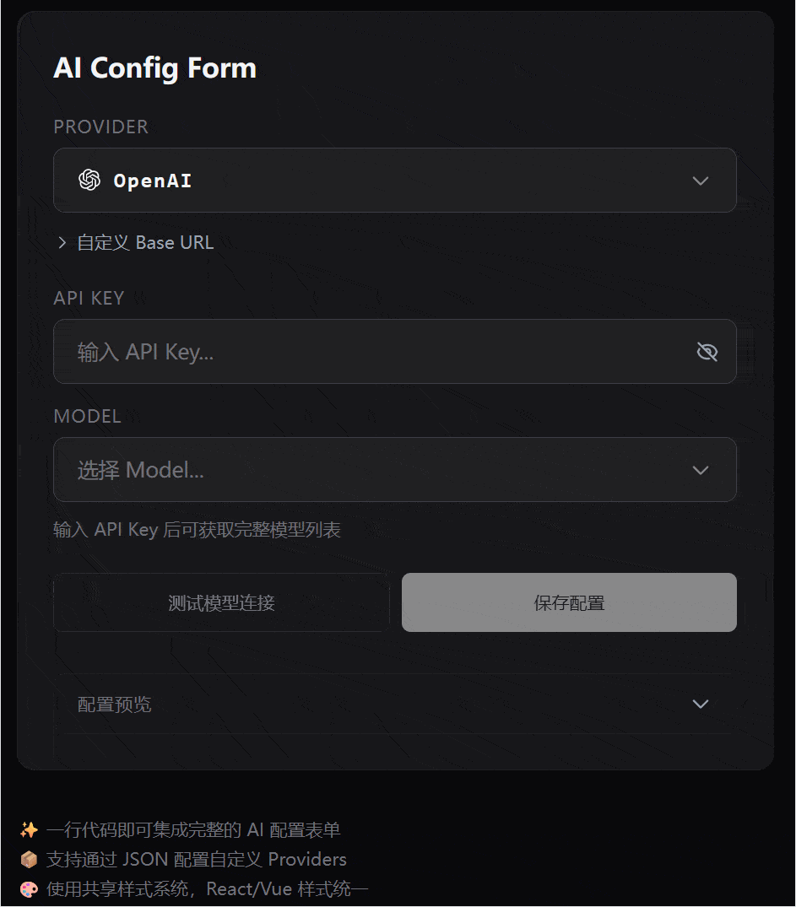

<div align="center">
  
  <h1>AI Selector</h1>
  <p>
    <a href="./README.md">简体中文</a> | <a href="./README.en.md">English</a>
  </p>
  <p><strong>如果你开发的应用/服务需要用户提供 AI 配置，试试 AI Selector 聚合配置和连接处理， 开箱即用，为 React 和 Vue 提供一致的 AI 服务接入体验 </strong></p>
  <!-- <p>开箱即用，内置 20+ 主流 AI 厂商配置可自定义扩展、模型列表智能管理、API Key 安全存储、连通性测试和配置持久化。为 React 和 Vue 提供一致的 AI 服务接入体验</p> -->

  <!-- GitHub Badges -->
  <p>
    <a href="https://www.npmjs.com/package/@tombcato/ai-selector-core">
      
    </a>
    <a href="https://www.npmjs.com/package/@tombcato/ai-selector-react">
      
    </a>
    <a href="https://www.npmjs.com/package/@tombcato/ai-selector-vue">
      
    </a>
  </p>

  <p>
    <a href="https://github.com/tombcato/ai-provider-selector/blob/main/LICENSE">
      
    </a>
    <a href="https://www.typescriptlang.org/">
      
    </a>
    <a href="https://react.dev/">
      
    </a>
    <a href="https://vuejs.org/">
      
    </a>
  </p>

  <p>
    <a href="https://tombcato.github.io/ai-selector">🚀 在线演示 (Live Demo)</a>
    ·
    <a href="#-核心组件-aiconfigform-参数详解">🔧 API 文档</a>
    ·
    <a href="#-快速开始">📖 快速开始</a>
    
  </p>
</div>

---

## 📑 目录

- [演示预览](#-演示预览)
- [核心特性](#-核心特性)
- [支持的 AI 厂商](#-支持的-ai-厂商-20)
- [快速开始](#-快速开始)
- [AIConfigForm 参数详解](#-核心组件-aiconfigform-参数详解)
- [useAIConfig Hook (Headless 模式)](#-headless-模式-useaiconfig-hook)
- [加密存储](#-加密存储)
- [项目结构](#-项目结构)
- [更新日志](./CHANGELOG.md)

---

## 📸 演示预览
本项目 UI 中的文本滚动动效由 **[Smart Ticker](https://github.com/tombcato/smart-ticker)** 提供支持。
<div align="center">



</div>

---

## ✨ 核心特性

| 特性 | 描述 |
|------|------|
| 🤖 **20+ 厂商** | OpenAI, Claude, Gemini, DeepSeek... 可自定义扩展 |
| ⚡ **智能模型发现** | 自动获取厂商最新模型列表，无需手动维护 |
| 📡 **连接诊断** | 一键测试 API 连通性与延迟 |
| � **AES 加密存储** | API Key 加密保存到 localStorage，非明文 |
| 🎨 **开箱即用 UI** | Tailwind CSS 设计系统，深色模式，中英双语 |
| 🔌 **React + Vue** | 双框架适配器，核心逻辑共享 |
| 🧩 **Headless 模式** | 只用 `useAIConfig` Hook，完全自定义 UI |
| 🔄 **零后端可选** | 支持前端直连 / 后端代理 / 自定义 fetcher |

---

## 🤖 支持的 AI 厂商 (20+)


| 图标 | 厂商 | ID | API 格式 | 需要 Key | Models API |
|:----:|------|----|---------:|:--------:|:----------:|
|  | **OpenAI** | `openai` | OpenAI | ✅ | ✅ |
|  | **Anthropic (Claude)** | `anthropic` | Anthropic | ✅ | ✅ |
|  | **Google Gemini** | `gemini` | Gemini | ✅ | ✅ |
|  | **OpenRouter** | `openrouter` | OpenAI | ✅ | ✅ |
|  | **DeepSeek** | `deepseek` | OpenAI | ✅ | ✅ |
|  | **Moonshot (Kimi)** | `moonshot` | OpenAI | ✅ | ✅ |
|  | **通义千问 (Qwen)** | `qwen` | OpenAI | ✅ | ✅ |
|  | **智谱 AI (GLM)** | `zhipu` | OpenAI | ✅ | ✅ |
|  | **硅基流动** | `siliconflow` | OpenAI | ✅ | ✅ |
|  | **火山方舟 (Doubao)** | `doubao` | OpenAI | ✅ | ✅ |
|  | **MiniMax** | `minimax` | OpenAI | ✅ | ❌ |
|  | **xAI (Grok)** | `xai` | OpenAI | ✅ | ✅ |
|  | **Groq** | `groq` | OpenAI | ✅ | ✅ |
|  | **Mistral AI** | `mistral` | OpenAI | ✅ | ✅ |
|  | **Together AI** | `together` | OpenAI | ✅ | ✅ |
|  | **Fireworks AI** | `fireworks` | OpenAI | ✅ | ✅ |
|  | **DeepInfra** | `deepinfra` | OpenAI | ✅ | ✅ |
|  | **Perplexity** | `perplexity` | OpenAI | ✅ | ❌ |
|  | **Cohere** | `cohere` | Cohere | ✅ | ✅ |
|  | **Ollama (Local)** | `ollama` | OpenAI | ❌ | ✅ |

> 💡 支持通过 `config.custom` 添加自定义增删改厂商

---


## 🔧 核心组件 AIConfigForm 参数详解

### 基础参数

| 参数名 | 类型 | 可选 | 默认值 | 描述 |
|--------|------|:---:|--------|------|
| `proxyUrl` | `string` | ✅ | - | 代理地址，留空则使用直连模式 |
| `title` | `string` | ✅ | - | 表单标题 |
| `language` | `'zh' \| 'en'` | ✅ | `'zh'` | 界面语言 |
| `showPreview` | `boolean` | ✅ | `false` | 显示配置预览 |
| `disabled` | `boolean` | ✅ | `false` | 禁用表单 |

### 高级配置

| 参数名 | 类型 | 可选 | 描述 |
|--------|------|:---:|------|
| `config` | `ProviderConfig` | ✅ | 厂商过滤与自定义 |
| `initialConfig` | `Partial<AIConfig>` | ✅ | 初始配置 |
| `modelFetcher` | `ModelFetcher` | ✅ | 自定义请求处理器 |

### 事件回调

| 事件名 | 类型 | 可选 | 描述 |
|--------|------|:---:|------|
| `onSave` | `(config) => void` | ✅ | 保存时触发 |
| `onChange` | `(config) => void` | ✅ | 配置变化时触发 |
| `onTestResult` | `(result) => void` | ✅ | 测试完成时触发 |

---
## 🏗️ AIConfigForm组件使用
#### 引入组件
```tsx
// React
import { AIConfigForm } from '@tombcato/ai-selector-react';
import '@tombcato/ai-selector-react/style.css'; // ⚠️ 务必引入样式

// Vue
import { AIConfigForm } from '@tombcato/ai-selector-vue';
import '@tombcato/ai-selector-vue/style.css'; // ⚠️ 务必引入样式

<AIConfigForm
  proxyUrl=""                 // 空字符串表示直连模式，或填入后端代理地址
  showPreview                 // 是否显示配置预览 JSON
  language="zh"               // 界面语言 'zh' | 'en'
  title="AI Configuration"    // 自定义卡片标题
/>
```
#### 进阶：自定义 Provider 配置 (ProviderConfig)

通过 `config` 属性，你可以过滤显示的厂商、修改现有配置或添加全新的自定义厂商。

```tsx
// 示例配置
const providerConfig: ProviderConfig = {
    mode: 'default', // 可选值: 'default' | 'customOnly'
    // custom: customProviders as Record<string, CustomProviderDefinition>, //导入自定义provider

    // ========================================================================
    // 场景 1: 只显示指定的 Provider (白名单过滤)
    // ========================================================================
    include: ['openai', 'anthropic'],
    exclude: ['gemini'], // 或者使用黑名单过滤

    // ========================================================================
    // 场景 2: 覆盖/添加自定义 Provider
    // ========================================================================
    custom: {
        // 覆盖内置配置
        openai: {
            name: 'Enterprise OpenAI',
            baseUrl: 'https://gateway.company.com/openai/v1',
            apiFormat: 'openai',
            needsApiKey: true,
            models: [{ id: 'gpt-4o', name: 'GPT-4o' }]
        },
        // 添加新厂商
        deepseeksssss: {
            name: 'DeepSeekssssss',
            baseUrl: 'https://api.deepseek.com',
            apiFormat: 'openai',
            needsApiKey: true,
            icon: 'https://avatars.githubusercontent.com/u/148330874',
            models: [{ id: 'deepseek-chat', name: 'DeepSeek Chat' }]
        }
    },


    // ========================================================================
    // 场景 3: 仅显示自定义 Provider
    // ========================================================================
    mode: 'customOnly',
    custom: {
        'my-private-model': {
            name: 'Internal AI',
            baseUrl: 'http://localhost:8080/v1',
            apiFormat: 'openai',
            needsApiKey: false,
            icon: 'https://placehold.co/32x32?text=INT',
            models: [
                { id: 'llama-3-8b', name: 'Llama 3 8B' },
                { id: 'mistral-7b', name: 'Mistral 7B' }
            ]
        }
    }
}

<AIConfigForm
  config={providerConfig}
  // ...其他参数
/>
```

### proxyUrl对应的三种接入 AI 厂商 API 的方式

#### 1️⃣ 直连模式 (默认)

前端直接请求 AI 厂商 API，**无需任何后端服务**。

```
浏览器 ────────────► AI 厂商 API
```

- ✅ 零配置，开箱即用
- ✅ 无需部署后端
- ⚠️ API Key 会暴露在浏览器 Network 中
- ⚠️ 部分厂商可能不支持浏览器跨域请求，导致接口失败


```tsx
import ...
<AIConfigForm
  proxyUrl="" //不设置代理
/>
```
### 2️⃣ 代理模式 (Proxy)

通过后端代理转发请求，**推荐生产环境使用**。

```
浏览器 ───► 后端代理 ───► AI 厂商 API
```

- ✅ 隐藏 API Key
- ✅ 绕过 CORS 限制
- ✅ 前后端架构分离
- 📦 需要部署 `backend/server.py`,或把相关逻辑集成到你自己的后端服务中，server.py实现三个api：/test /models /chat
```tsx
import ...
<AIConfigForm
  proxyUrl="后端代理地址" //backend server.py本地代理为http://localhost:8000
/>

```
**推荐使用代理的场景：**
- 生产环境部署
- 需要隐藏 API Key
- 遇到 CORS 错误

### 3️⃣ 自定义模式 (ModelFetcher)

完全自定义请求逻辑，由开发者接管所有 API 调用。

```tsx
import ...
<AIConfigForm
  proxyUrl="" //不设置代理
  modelFetcher={async (params) => {
    // 自定义实现模型列表获取、连接测试等
    if (params.type === 'fetchModels') {
      return await yourCustomFetch(params);
    }
  }}
/>
```

- ✅ 完全控制请求逻辑
- ✅ 可对接任意后端架构
- 💻 需要开发者实现


---

## 🚀 快速开始

### 1. 安装依赖

```bash
npm install @tombcato/ai-selector-core

# Optional: Framework Adapters
npm install @tombcato/ai-selector-react
npm install @tombcato/ai-selector-vue
```


### 2. 本地调试（可选）

```bash
git clone https://github.com/tombcato/ai-selector.git
cd ai-selector
npm install
```

### 3. 启动 Demo

```bash
# React Demo
npm run dev -w packages/react

# Vue Demo
npm run dev -w packages/vue
```

打开 `http://localhost:5173` 即可体验（默认直连模式）。

### 4. 启用代理 (可选)

```bash
# 1. 启动后端
cd backend
pip install -r requirements.txt
python server.py

# 2. 配置代理地址
# 创建 packages/react/.env.local 文件：
VITE_PROXY_URL=http://localhost:8000
```

> 💡 **无需重启前端**，Vite 会自动加载 `.env.local` 中的环境变量。

---

## 🔧 Headless 模式 (useAIConfig Hook)

如果你不需要内置 UI，只想使用配置逻辑，可以直接使用 `useAIConfig` Hook：

### React

```tsx
import { useAIConfig } from '@tombcato/ai-selector-react';

function MyCustomUI() {
    const {
        // 状态
        providerId,          // 当前选中的 Provider ID
        apiKey,              // API Key
        model,               // 当前选中的 Model ID
        modelName,           // Model 显示名称
        baseUrl,             // 自定义 Base URL
        models,              // 可用模型列表
        provider,            // 当前 Provider 对象
        providers,           // 所有可用 Providers
        isValid,             // 配置是否完整有效
        testStatus,          // 测试状态: 'idle' | 'testing' | 'success' | 'error'
        testResult,          // 测试结果对象
        isFetchingModels,    // 是否正在获取模型列表
        fetchModelError,     // 获取模型错误信息
        config,              // 完整配置对象
        
        // 方法
        setProviderId,       // 设置 Provider
        setApiKey,           // 设置 API Key
        selectModel,         // 选择 Model (id, name)
        setBaseUrl,          // 设置 Base URL
        runTest,             // 执行连接测试
        save,                // 保存配置到 Storage
    } = useAIConfig({
        proxyUrl: '',                    // 可选：代理地址
        providerConfig: {},              // 可选：Provider 配置
        initialConfig: {},               // 可选：初始配置
        onSerialize: (data) => data,     // 可选：序列化钩子
        onDeserialize: (data) => data,   // 可选：反序列化钩子
        modelFetcher: async () => [],    // 可选：自定义模型获取
    });

    // 使用这些状态和方法构建你自己的 UI
    return (
        <div>
            <select value={providerId} onChange={e => setProviderId(e.target.value)}>
                {providers.map(p => <option key={p.id} value={p.id}>{p.name}</option>)}
            </select>
            {/* ... 你的自定义 UI */}
        </div>
    );
}
```

### Vue

```vue
<script setup lang="ts">
import { useAIConfig } from '@tombcato/ai-selector-vue';

const {
    providerId, apiKey, model, models, providers, isValid,
    setProviderId, setApiKey, selectModel, runTest, save
} = useAIConfig({ proxyUrl: '' });
</script>

<template>
    <!-- 你的自定义 UI -->
</template>
```

---

## 加密存储API Key

配置默认使用 **AES 加密**存储到 localStorage，防止 API Key 明文泄露。

```typescript
import { 
    createConfigStorage, 
    encryptedStorageAdapter,  // 默认，AES 加密
    plainStorageAdapter       // 明文（不推荐）
} from '@tombcato/ai-selector-core';

// 默认使用加密
const storage = createConfigStorage();

// 使用明文（不推荐）
const plainStorage = createConfigStorage(plainStorageAdapter);

// 自定义序列化
const customStorage = createConfigStorage(encryptedStorageAdapter, {
    serialize: (data) => JSON.stringify(data),
    deserialize: (data) => JSON.parse(data),
});
```

> ⚠️ 加密密钥默认为 `'aiselector'`，适合防止普通用户直接查看，不适用于高安全场景。

---

## 📁 项目结构

```
ai-provider-selector/
├── packages/
│   ├── core/           # 核心逻辑 (框架无关)
│   ├── react/          # React 适配器
│   └── vue/            # Vue 适配器
├── backend/            # Python 代理服务
│   ├── server.py
│   └── strategies.py
├── index.html          # Landing Page
└── logo.svg
```

---


## 📜 许可证

[MIT License](./LICENSE) © 2026 AI Selector

<div align="center">
  <sub>Made with ❤️ by <a href="https://github.com/tombcato">tombcato</a></sub>
</div>
